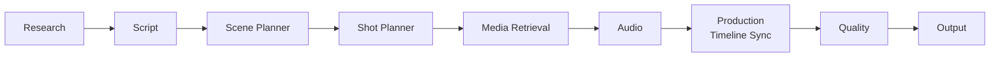
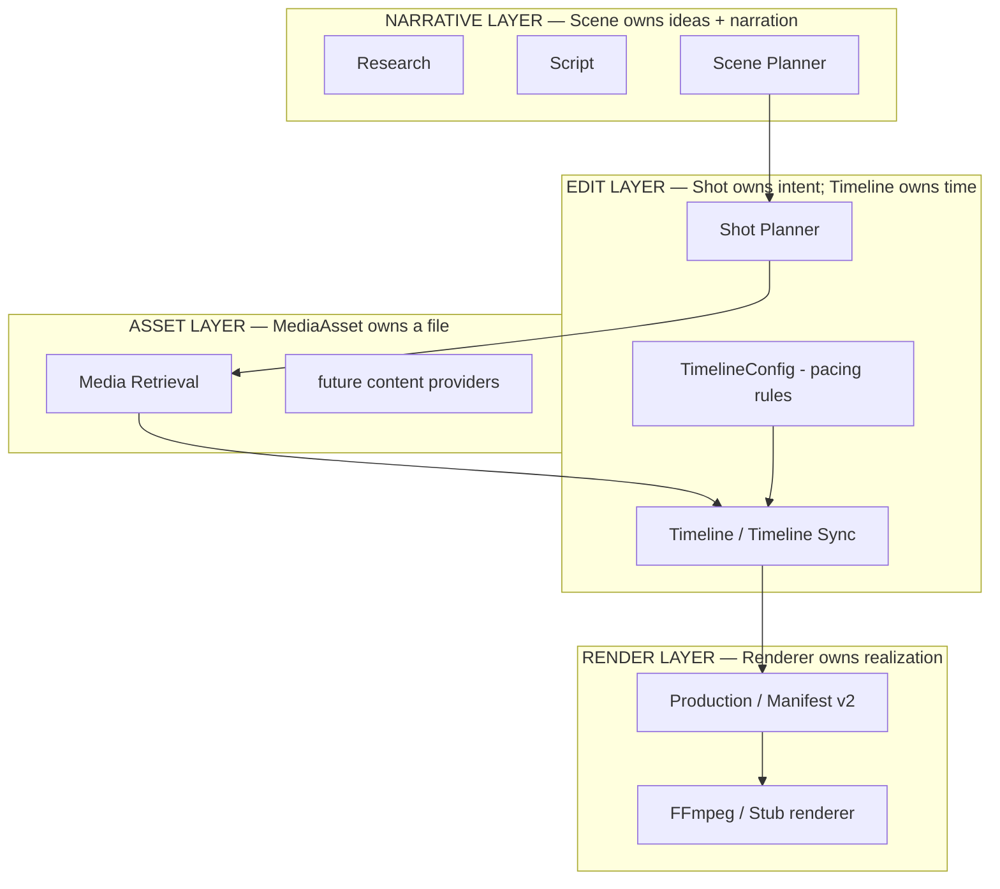

# ACCE V2 — Architecture

**Status:** FROZEN · **Applies to:** V2 · **Supersedes:** `docs/architecture.md` for V2 work

This document is the architectural reference for ACCE V2. It has been reviewed
and approved. It is **frozen**: implementation follows this document, and future
features fit *into* this design rather than changing it (see
[Governance](#governance)).

---

## 1. Why V2

V1 assumes **1 Scene = 1 Visual Asset**. That couples three distinct concerns:

- **Narrative** — what the video *says* (one scene = one narration block)
- **Editing** — what the viewer *sees* and when (visual change, pacing)
- **Implementation** — which files back the visuals (search, rank, download)

A 25-second narration over a single stock clip quickly becomes boring. Editing
means *visual change*; narrative structure and visual editing are different
concepts and must not share one object.

V2 separates them:

> **Scene** (narrative) → **Shot** (editing) → **Asset** (implementation)

## 2. Design principles

1. **Scene = narrative.** One scene is one narrative idea with its narration. A
   scene knows nothing about media.
2. **Shot = editing.** A shot is "what the viewer should see" — an ordered
   visual intent (purpose, queries, content kind, motion intent, importance). A
   shot never names a file.
3. **Asset = implementation.** A `MediaAsset` is a specific file the pipeline
   found, ranked, and (optionally) downloaded for a shot.
4. **Narration owns the clock.** Audio and subtitles follow narration. Shots
   subdivide scene time; they never change it.
5. **Determinism over cleverness.** Pacing is computed from narration +
   importance + configuration — never from search results, never from an LLM.

## 3. Architectural invariants (FROZEN)

These rules are non-negotiable. Changing any of them requires the change process
in [Governance](#governance).

| # | Invariant |
|---|-----------|
| I1 | **Scene owns narrative only.** No media fields, no queries, no file references. |
| I2 | **Shot owns visual intent only.** No durations, no file references. |
| I3 | **MediaAsset owns files only.** No editing or narrative semantics. |
| I4 | **Timeline owns time only.** It binds shots to assets at concrete times. |
| I5 | **Renderer owns pixels only.** It consumes a manifest and renders; it never plans. |
| I6 | **Assets never influence pacing.** The Timeline is computed from measured narration duration + shot importance + pacing configuration. Media output is *never* an input to timing. |
| I7 | **Narration owns the global clock.** Scene timing comes from the Audio stage's *measured* narration durations. Shots subdivide that time; the sum of a scene's clip durations must equal its measured narration duration (within tolerance). |
| I8 | **Estimated duration is a planning aid, never authoritative.** Only measured narration duration may enter the Timeline. |
| I9 | **Shots never cross scene boundaries.** Each shot belongs to exactly one scene. |
| I10 | **Subtitles and the master mix follow narration only.** They are orthogonal to the edit layer and must never be influenced by shots. |
| I11 | **One global clock, two projections.** Audio/subtitles project onto scene boundaries; visuals project onto clip boundaries; both live on the same timeline. A divergence between the projections is a bug. |
| I12 | **Renderer never performs planning.** Any decision that shapes the edit belongs upstream (Shot Planner, Timeline) and reaches the renderer only as part of the manifest. |

## 4. Pipeline



- **Scene Planner** — narrative only. Outputs `ScenePlan`.
- **Shot Planner** *(new stage)* — per-scene ordered visual intents. Outputs
  `ShotPlan`. Uses narration + estimated duration + rhythm. Never reads media.
- **Media Retrieval** — per-shot search / rank / select / download. Outputs
  `MediaPlan`.
- **Audio** — narration (measured durations), music, mix, subtitles. Contract
  unchanged.
- **Production** — Timeline Sync: allocates clip durations, resolves motion,
  applies the placeholder policy, builds the render manifest v2, and renders.
- **Quality** — deterministic validation, including shot-level checks.

Audio sits *between* Media and Production so the Timeline can consume *measured*
narration durations — this ordering is load-bearing (I7, I8).

### Ownership layers



Audio and subtitles run beside the edit layer and bind to narration only — they
never read the edit layer.

## 5. Core data model

```python
# ── NARRATIVE LAYER ────────────────────────────────────────────────
class Scene(BaseModel):
    scene_id: str              # "scene_0001" — stable id, not ordinal
    narration: str             # one narrative idea, one narration block
    estimated_duration: float  # PLANNING ONLY (I8); never authoritative
    rhythm: Rhythm = "medium"  # optional pacing bias (see §7)
    metadata: dict = {}        # style, tone, hook/ending hints
    # NO visual_description / search_keywords / visual_type / transition

class ScenePlan(BaseModel):
    scenes: list[Scene]

# ── EDIT LAYER ─────────────────────────────────────────────────────
class Shot(BaseModel):
    shot_id: str               # "shot_0001" — global; manifests reference these
    scene_id: str              # owner; a shot never leaves its scene (I9)
    position: int              # ordering within the scene
    purpose: str               # "establish" | "action" | "reaction" | "detail" | ...
    visual_description: str    # what the viewer should see
    search_queries: list[str]  # candidate queries — NOT a file
    content_kind: Literal["stock_video", "stock_image", "text", "chart", "map"]
    media_preference: Literal["video", "image", "either"] = "either"
    motion_intent: Literal["none", "zoom_in", "zoom_out", "pan"] = "none"
    importance: ShotImportance  # LOW | MEDIUM | HIGH | CRITICAL
    transition_out: str = "cut"

class ShotPlan(BaseModel):
    shots: list[Shot]

# ── ASSET LAYER ────────────────────────────────────────────────────
class MediaAsset(BaseModel):
    asset_id: str              # owned by one shot
    shot_id: str               # back-reference; asset belongs to a shot
    provider: str
    media_type: Literal["image", "video"]
    url: str
    local_path: Path | None
    license: str
    attribution: str | None
    candidates: list[MediaHit]  # full ranked list

class MediaPlan(BaseModel):
    assets: list[MediaAsset]

# ── RENDER LAYER ───────────────────────────────────────────────────
class MotionDescriptor(BaseModel):  # resolved by Timeline, applied by renderer
    kind: Literal["none", "kenburns_zoom_in", "kenburns_zoom_out",
                  "pan_left", "pan_right", "pan_up", "pan_down"]
    duration: float

class Clip(BaseModel):              # V2: Clip → Asset (see §10 for future layers)
    shot_id: str
    scene_id: str
    asset_id: str                   # renderer resolves assets by id — never position
    start: float
    end: float
    transition_out: str = "cut"
    motion: MotionDescriptor | None = None  # resolved by Timeline

class Timeline(BaseModel):
    clips: list[Clip]
    duration: float

class RenderManifest(BaseModel):    # version: int = 2
    timeline: Timeline
    assets: list[ManifestAsset]     # keyed by asset_id
    audio_path: Path | None
    subtitle_path: Path | None
    settings: RenderSettings
```

**Ownership rules encoded in the model**

- Scene owns narration. Shot owns visual intent. MediaAsset owns a file. Clip
  owns *timing + binding* — the only object that pairs a shot's intent with a
  chosen asset at a time.
- A Shot has at most one MediaAsset. A MediaAsset belongs to exactly one Shot. A
  Clip belongs to exactly one Shot and references exactly one MediaAsset.
- No object reaches across layers: a Shot never contains a file path; a Scene
  never contains a query; a Clip never contains narration.

**Does not change:** `SubtitleCue`, `AudioCue`, `AudioMixPlan`, `MixSegment`,
`AudioOutput`, `RenderSettings`. The audio/subtitle contracts are
architecture-stable.

## 6. Responsibility map

| Concern | Owner | Justification |
|---------|-------|---------------|
| Narrative ideas, narration text, scene split | **Scene Planner** | Pure narrative (I1). |
| Scene timing — authoritative | **Audio** (measured TTS) | Only measured durations may time the Timeline (I7, I8). |
| Scene timing — planning estimate | **Scene Planner** | Planning aid only (I8). |
| Shot structure (count, order, intent, importance, queries) | **Shot Planner** | Creative editing decision; uses narration + estimate + rhythm. Never reads media. |
| Pacing rules (importance→weight, min/max duration, count bounds, rhythm biases) | **Configuration** (deterministic) | Rules are constants, not LLM output. Reproducible and testable. |
| Duration allocation (weights → seconds within each scene's measured budget) | **Timeline** (Production) | Deterministic solver honoring I7/I8. |
| Asset selection (search / rank / select / download) | **Media Retrieval** | Never the planner; never influences timing (I6). |
| Placeholder policy (what renders when a shot has no asset) | **Timeline** (config-driven) | Editing decision; deterministic. |
| Motion resolution (intent → concrete motion, given asset type) | **Timeline** (V2) | Needs shot intent + the chosen asset's media type. *Future home: Shot Resolver (§8).* |
| Transitions | **Clips** (`transition_out`), rendered by **Renderer** | An edit property; belongs on the edit, not on the scene. |
| Subtitles, master mix | **Audio** (narration-only) | Orthogonal to edits (I10). |
| Burn-in, filters, encode | **Renderer** | Consumes the manifest only; id-lookup assets; renders clips + motion (I5, I12). |
| Quality validation (scene / shot / asset / timing) | **Quality** | Extended deterministic checks. |

## 7. Scene Rhythm

A scene may optionally carry `rhythm: LOW | MEDIUM | HIGH | INTENSE` (default
`MEDIUM`). Rhythm expresses the *intended editing energy* of a scene. It is a
**bias**, not a specification:

- Rhythm does **not** directly set a shot count.
- Rhythm shifts the pacing configuration the Timeline applies to that scene's
  allocation (e.g. `LOW` → fewer, longer shots; `INTENSE` → more, shorter shots).

Per scene, the Timeline combines:

```
measured narration duration × importance weights × pacing config (biased by rhythm)
```

Rhythm is optional and future-configurable. The Shot Planner may use it as a
*suggestion* when proposing shots; the Timeline is authoritative for actual
count and durations. Adding or tuning a rhythm bias touches configuration only —
never the data model, and never the renderer.

## 8. Shot Resolver — documented extension point, NOT implemented

Between Media Retrieval and Timeline, the architecture reserves a future
component, **Shot Resolver**.

**Responsibilities (when it exists):**

- Reconcile planner intent with retrieved assets (e.g. a shot that requested
  video but only an image was found).
- Decide the fallback strategy for such mismatches.
- Decide the motion strategy for the matched asset.
- Prepare the final shot (intent + chosen asset) before the Timeline allocates
  time.

**Status:** documentation only. It does **not** exist in Phase 1, Phase 2, or
Phase 3. In V2 these reconciliations (fallback, motion resolution, placeholder
policy) are implemented inline in the Timeline, exactly as the responsibility
map states. The Shot Resolver is the *future extraction point* for that logic if
it grows — a refactor, not a redesign. Freezing the seam now means that
extraction will not ripple through the data model.

## 9. Object flow (one scene)

```
Scene_0001   narration: "…"   rhythm: HIGH   estimated: 23s
 │ Shot Planner
 ▼
 Shot_0001  Launch   [HIGH, video]   queries=["rocket launch closeup", …]
 Shot_0002  Ascent   [MEDIUM, video] queries=["rocket liftoff night", …]
 Shot_0003  Orbit    [HIGH, either]  queries=["earth from orbit ISS", …]
 Shot_0004  Landing  [CRITICAL, video] queries=["moon landing apollo", …]
 │ Media Retrieval
 ▼
 asset_a ← Shot_0001 (video, pexels)     asset_b ← Shot_0002 (video, wikimedia)
 asset_c ← Shot_0003 (image, pexels)      asset_d ← Shot_0004 (video, pixabay)
 │ Audio (measured narration ≈ 23.0s total) — the clock
 ▼ Timeline
 clip1  Shot_0001  asset_a   0.0 – 5.0    cut       motion=None
 clip2  Shot_0002  asset_b   5.0 – 8.0    cut       motion=None
 clip3  Shot_0003  asset_c   8.0 –13.0    dissolve  motion=kenburns_zoom_in
 clip4  Shot_0004  asset_d  13.0 –23.0    fade      motion=None
 ▼ RenderManifest v2 → Renderer (asset lookup by id; apply motion; xfade)
```

Note Shot_0003: the planner asked for video, media returned an image, and the
Timeline resolved a Ken Burns. The intent survived, the slot was filled, and
nothing in the narrative or edit contracts changed.

## 10. Future evolution paths (documented, non-breaking)

These features are anticipated. None requires a redesign; each lands as a local
extension.

- **Split screens / overlays / motion graphics:** evolve `Clip → Asset` into
  `Clip → [Layer → Asset]`. Renderer-adjacent; `Scene`, `Shot`, `MediaAsset`,
  and `Timeline` contracts are untouched.
- **Charts, maps, AI-generated images/video, B-roll:** new *content providers*
  behind the Media Retrieval chain. A shot names a `content_kind`; a provider
  returns candidates for a shot. No edit-layer change.
- **Ken Burns / camera motion:** already expressed as `motion_intent` →
  `MotionDescriptor` (Phase 2 plumbing). Only new descriptor kinds may be added.
- **Shot Resolver extraction:** see §8.
- **Beat-sync audio:** the V1 seam (`AudioMixPlan`) is unchanged; only the
  segment-timing computation changes.

## 11. Migration strategy

Three phases. **After every phase the pipeline runs and produces a valid video.**
No big-bang rewrite. The Shot Resolver (§8) is not built in any phase.

### Phase 1 — Shot concept as a pass-through (pure addition)

- New `modules/shots/` (schemas, interface, default, template).
- New `Stage.SHOTS` between `SCENES` and `MEDIA`.
- Default Shot Planner: a deterministic template producing exactly **1 shot per
  scene** (queries/type copied from the scene's existing visual fields).
- Nothing downstream consumes it yet; `shot_plan.json` is written as an artifact.
  Media / timeline / render keep the V1 scene-keyed path. Because 1 shot == 1
  scene, behavior is byte-identical.

| Files | Complexity | Risk | Compat |
|-------|-----------|------|--------|
| `modules/shots/*` (new), `core/stages.py`, `modules/factory.py` | Low | Near-zero (additive) | Full |

### Phase 2 — Media + renderer cutover to shots (behind a version bump)

- Media module consumes `ShotPlan`; per-shot assets; `MediaAsset.shot_id`
  (scene_number kept as a compat property).
- Timeline builder produces **Clips** (`shot_id`, `asset_id`, `start`/`end`);
  motion-descriptor plumbing (no-op when absent); allocation still 1:1 per scene.
- **RenderManifest → v2** (`clips`, asset lookup **by id**, never position) plus
  a **manifest normalizer** so old saved V1 jobs still render.
- Renderer renders clips; gains optional per-clip motion (zoompan) only when a
  manifest carries a resolved descriptor.

| Files | Complexity | Risk | Compat |
|-------|-----------|------|--------|
| `modules/media/{schemas,default}.py`, `modules/production/{timeline,manifest,schemas,ffmpeg,renderer}.py`, quality media check | Medium–High (the renderer edit) | strict-`zip` removal; mitigated by id-lookup + normalizer + contract tests | V1 jobs render via normalizer; output equivalent to today |

### Phase 3 — Scenes go narrative-only; multi-shot generation on

- `Scene` reschema: visual fields removed (deprecated aliases for lazy
  migration); **`rhythm` added**.
- Real Shot Planner (LLM): scene narration → 2–5 shots (purpose, queries,
  content_kind, motion_intent, importance, transition_out) plus a **normalizer**
  (clamp count, drop empty queries, schema repair), with the deterministic
  template as the key-free default.
- Timeline Sync live: importance-weight allocation within the measured per-scene
  narration budget, rhythm-biased pacing, min/max shot bounds, placeholder
  policy, motion resolution (inline — Shot Resolver is not built).
- Quality adds shot checks (count bounds, min duration, asset↔shot coverage,
  audio-vs-edit duration consistency).

| Files | Complexity | Risk | Compat |
|-------|-----------|------|--------|
| `modules/scenes/{schemas,default}.py`, `modules/shots/default.py`, `config/settings.py` (pacing), `modules/quality/default.py` | Medium | LLM shot variance → normalizer; determinism → pacing in config | Scene aliases preserve old reads |

## 12. Governance (frozen architecture)

- The architecture in this document is **frozen** for V2.
- Implementation follows it. Future features fit *into* this design (see §10).
- If a feature genuinely requires a change to an invariant (§3) or a data-model
  change that ripples across layers, the change must be **explained and approved
  before implementation**: state which invariant breaks, why the design cannot
  absorb the feature, and the smallest change that restores a clean architecture.
