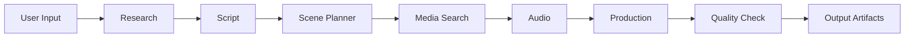
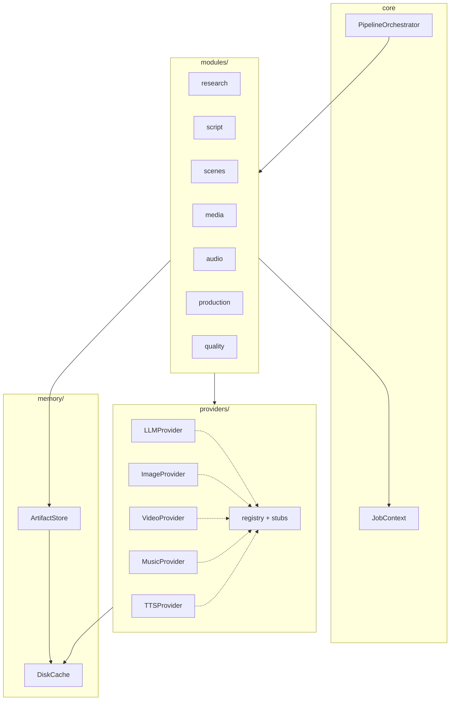
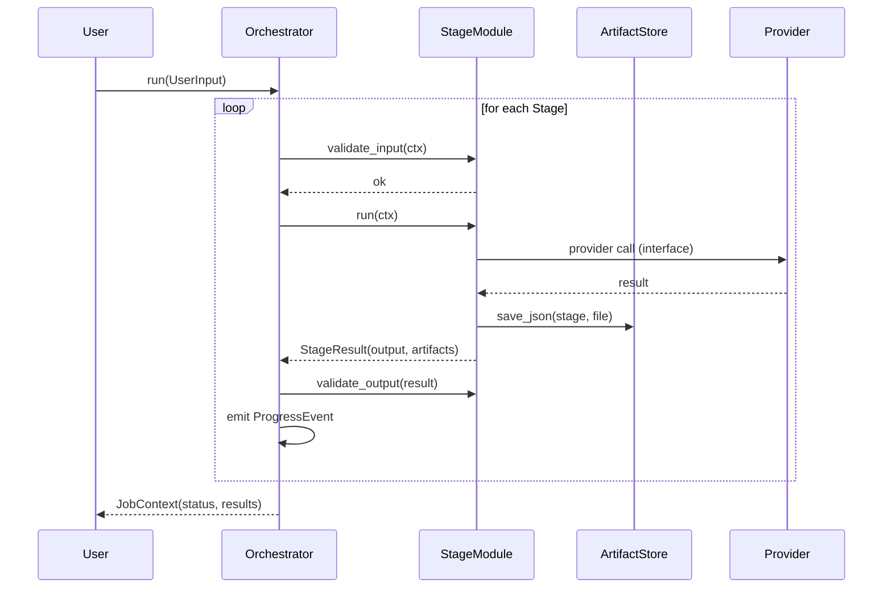
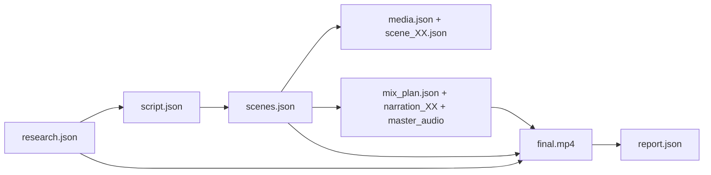
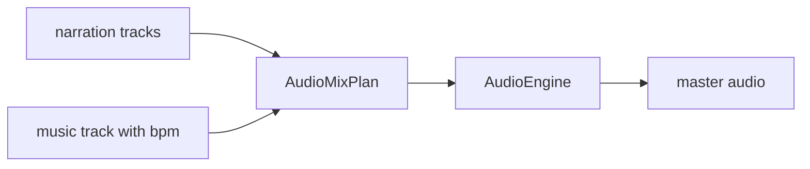

# ACCE V1 — Architecture

## Pipeline

Each stage is one module implementing the `StageModule` contract
(`validate_input` → `run` → `validate_output`). The `PipelineOrchestrator`
executes modules in `Stage` definition order; a failed stage is retried
*on its own* (default 2 retries) before the job fails.

## Layer diagram

Rules:

- No module calls an external API directly — only provider interfaces.
- No module resolves globals — dependencies are injected via constructors
  (`modules.factory.build_orchestrator`).
- Every module writes its output into `out/<job_id>/<stage>/` via
  `ArtifactStore`.

## Job sequence

## Artifact flow

## Audio: beat-sync-ready seam

The audio stage produces a timestamped `AudioMixPlan` (list of `MixSegment`s)
and hands it to an `AudioEngine` that renders the master track:

V2 beat-synchronization changes **only** how the plan's segment timings are
computed (music `bpm` → beat-aligned boundaries) inside
`DefaultAudioModule._build_mix_plan`. The plan contract, the engine, and all
downstream consumers stay unchanged.
