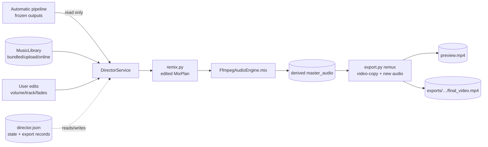

# Director Mode (Music) — Architecture

*Post-production overlay for the Audio Pipeline. Not a replacement for automatic
selection — an optional, user-driven pass that edits *only* the background music
before the documentary is exported. The automatic pipeline is untouched; the
documentary (visuals, narration, timing) is frozen and unchanged.*

---

## 0. Goals & Non-Goals

**Goals**

- Give the user creative control over the music *after* a fully automatic run:
  keep / remove / swap / upload / re-mix the bed, tune volume + fades, preview
  instantly, export when satisfied.
- Zero changes to the automatic workflow. The pipeline produces the exact same
  artifacts today and tomorrow.
- Editing is cheap: changing music never re-runs research, script, shots, media,
  narration, or the visual render.
- The original generated assets are immutable; Director Mode only *derives* new
  files.
- The design grows into a broader post-production studio (multi-track, scene-
  specific music, ambience, SFX, voice, intro/outro, silence) without a redesign.

**Non-goals (V1)**

- No visual / timing / narration editing. Music is the only editable dimension.
- No beat-sync, ducking curve editing, or per-scene music in V1 (the model below
  makes them a data-only addition later).

---

## 1. Workflow

```
Generate Documentary                      (automatic pipeline, unchanged)
        │  → research, script, shots, media, narration, AI music, mix, render
        ▼
Automatic Music Selection                 (Planner → Retriever → Timeline → Mix)
        │  → frozen artifacts: audio.json, mix_plan.json, master_audio.m4a,
        │    final_video.mp4, render_manifest.json
        ▼
Director Mode                             (new post-production overlay)
        │  user opens the run in Studio → Preview → Director Mode
        │    • hears the AI-selected bed
        │    • previews the finished documentary (video + audio)
        ▼
User edits music                          (no regeneration, all in-memory/state)
        │  • keep AI pick        • remove music
        │  • pick from library   • upload their own MP3/WAV
        │  • volume / fades / mute
        ▼
Instant preview                           (remix audio → remux with video copy)
        ▼
Final Export                             (immutable export; original untouched)
```

Every edit is a **state change + a re-derive**, never a re-run. The heavy
stages (LLM, TTS, media download, visual encode) are structurally excluded.

---

## 2. Architecture & Integration

### 2.1 The core insight

The existing production seam is already audio-swappable:

- `RenderManifest` carries `audio_path`; the renderer muxes it as the video's
  audio track (`modules/production/ffmpeg.py`). Swapping `audio_path` = new
  audio, identical visuals.
- `mix_plan.json` is the frozen, per-segment audio graph (narration segments +
  one music segment). Editing *only* the music segment(s) and re-running
  `FfmpegAudioEngine.mix` yields a new master without touching narration.
- `rank_assets` already returns a deterministic, weighted ranking — the exact
  mechanism needed for "recommended alternatives".

Director Mode is therefore a **thin, read-only-over-the-pipeline module**: it
loads frozen outputs, lets the user choose a track, rebuilds a `MixPlan`,
remixes, and remuxes. It never imports stage internals it doesn't need and never
writes into the pipeline's output dirs.

### 2.2 What is reused / new / unchanged

| Existing component | Reused as | How |
|---|---|---|
| `AudioMixPlan` / `MixSegment` | contract | Director edits a copy of `mix_plan.json` |
| `FfmpegAudioEngine.mix` + `build_mix_command` | the remixer | remix master from the edited plan (unchanged) |
| `flatten_timeline` / `build_audio_timeline` | plan rebuild | optional path for recommended-track plans |
| `rank_assets` + `MusicSelection` | recommendations | top-N alternatives for the job's saved intent |
| `LocalMusicProvider` (+ asset probing) | library index | bundles `assets/music/` for browsing |
| `RenderManifest` | export contract | full re-render fallback; remux reads it for metadata |
| `FFmpegRenderer` | full re-render fallback | only if visuals ever change (future) |
| `StaticFiles` `/artifacts` mount | serving | previews + exports served to the UI |
| `MusicConfig` / `AudioConfig` | defaults | volumes/fades/duck/weights |

| New component | Responsibility |
|---|---|
| `modules/director/schemas.py` | `DirectorState`, `MusicEdit`, `TrackRef`, `ExportRecord`, `MusicTrack` DTO |
| `modules/director/library.py` | unified `MusicLibrary` over bundled / uploads / online sources |
| `modules/director/remix.py` | `build_director_plan(original_plan, edits) → MixPlan` + remix |
| `modules/director/export.py` | `Exporter.remux(video, master, out)` + full-render fallback |
| `modules/director/store.py` | `DirectorStore` — loads/saves `director.json`, uploads, exports |
| `modules/director/service.py` | `DirectorService` — the read/edit/preview/export orchestration |
| API endpoints + Studio UI | `GET/POST /api/jobs/{id}/director/*`, `/api/music/library`, Director panel |

| Unchanged (byte-identical) |
|---|
| `modules/audio/music/planner.py`, `retrieve.py`, `timeline.py`, `normalize.py` |
| `modules/audio/default.py` (the Audio stage), `engine.py`, `mix.py` |
| `modules/production/*` (renderer, manifest, ffmpeg, timeline, default) |
| `core/orchestrator.py`, `modules/factory.py` — the pipeline graph |
| Existing API routes for artifacts / music / jobs |

Director Mode **is not a pipeline stage**. It is a post-production service wired
at the API layer (`DirectorService` ← routes), with its own module. The
orchestrator and `factory` never know it exists.

> **Namespace roadmap.** V1 ships as `modules/director/`. The long-term
> container is `modules/studio/` — a Post-production Studio where **Music is
> simply the first feature** and Director Mode is the **first workflow** inside
> it. When a second lane lands (captions, SFX, ambience, color, intro/outro),
> `director/` is relocated/renamed into `studio/`; the shapes it defines
> (track-stack state, unified library, immutable exports) move as-is — this is
> a rename, not a redesign (see §8 Roadmap).

### 2.3 Data flow



---

## 3. State Management

**Rule: the pipeline's outputs are never modified.** All Director state lives in
a new, per-job store under the job dir:

```
out/<job_id>/
  director/
    director.json          # the authoritative editor state (versioned)
    uploads/               # user-uploaded tracks (copied in → job is self-contained)
    preview/               # transient preview master + preview.mp4
  exports/
    <export_id>/           # immutable exports (see §7)
      final_video.mp4
      export.json
```

### `director.json` (v1 schema)

```jsonc
{
  "version": 1,                        // forward-compat (see §8)
  "base": {                            // frozen references into the pipeline
    "audio_plan_path": "audio/audio_plan.json",
    "mix_plan_path": "audio/mix_plan.json",
    "master_path": "audio/master_audio.m4a",
    "video_path": "production/final_video.mp4",
    "ai_track": "music_0001"           // track_id of the AI-selected bed
  },
  "music": {                           // the CURRENT editable music state
    "mode": "ai" | "library" | "upload" | "none",
    "track_ref": { "track_id": "music_0001" | "upload:my-song.mp3", "source": "bundled" },
    "volume": 0.2,                     // 0.0–1.0, mirrors ACCE_AUDIO__MUSIC_VOLUME default
    "fade_in": 1.0,
    "fade_out": 1.0,
    "duck": true,
    "loop": true
  },
  "uploads": [ "my-song.mp3" ],        // files in director/uploads/ (probed on index)
  "exports": [ "ex_<ts>_<rand>" ]      // immutable export_ids, newest first
}
```

**Design rules**

- `track_ref.track_id` is a **stable id, never a filesystem path**. Paths are
  resolved by the library per source, so a track can move / be re-probed without
  breaking saved state.
- `music.mode` makes the semantics explicit (`ai` = the original pick, `none` =
  narration-only). "Revert to AI recommendation" is literally `mode: "ai"`.
- Uploads are **copied** into `director/uploads/` so the job is portable and the
  original upload in the user's OS is never touched.
- The **authoritative** records are JSON files on disk (not only in API memory)
  — a Studio refresh or server restart never loses an edit or an export.
- The **frozen** `mix_plan.json` remains the narration truth. Director only reads
  it and derives a new plan.

---

## 4. Music Library

The UI must never care where a track came from. A single abstraction:

```python
class MusicTrack(BaseModel):
    track_id: str        # "music_0001" | "upload:<stem>" | "pixabay:<id>"
    title: str
    provider: str        # "bundled" | "upload" | "pixabay" | "online:…"
    source: str          # human label for the UI chip
    duration: float      # probed (ffprobe) — never guessed
    bpm: int | None
    license: str | None
    stream_url: str      # `/api/music/library/{track_id}/stream`
    download_path: str | None
```

### `MusicLibrary` (new)

```python
class MusicSource(ABC):
    name: str
    def list(self) -> list[MusicTrack]: ...
    def resolve(self, track_id: str) -> Path | None: ...
    def stream(self, track_id: str) -> FileResponse | None: ...

class BundledSource:   # wraps LocalMusicProvider over assets/music/
class UploadSource:    # per-job director/uploads/ (scoped to a job)
class OnlineSource:    # Pixabay (search) when configured; future providers plug in
```

- **Bundled** — the existing `assets/music/` folder, via `LocalMusicProvider` +
  the same ffprobe duration probing used by the retriever. Tracks get stable ids
  (`music_0001`, …).
- **Upload** — files the user dropped for a job, copied into `director/uploads/`.
  Registered in `director.json`. Probed for duration/bpm where possible.
- **Online** — provider search (Pixabay) is exposed as a *searchable* source when
  a key is configured; hits are materialized the same way the retriever does
  today (download to cache) so `resolve()` returns a local file.

The existing **retriever ranking is reused for "recommended alternatives"**: call
`rank_assets(assets, MusicSelection(intent=saved_intent, duration_hint=narration_total),
MusicConfig())` and surface `ranked[1..N]` (index 0 = what the pipeline already
picked). Recommendations therefore always agree with the automatic pipeline's
taste — Director Mode is "same ranking, human choice", not a second opinion.

> **Roadmap — User Collections / Playlists.** The library abstraction naturally
> extends to named sets of `track_id`s, provider-agnostic by construction:
>
> ```jsonc
> { "collection_id": "col_space", "name": "Space",
>   "track_ids": ["music_0003", "upload:my-drones.mp3", "pixabay:4123"] }
> ```
>
> Examples: *My Favorites, Space, History, Emotional, Sci-Fi*. A collection is
> pure data over the unified index — it works across bundled / uploaded /
> online tracks, follows renames by `track_id`, and is stored per-user (future
> `collections.json`). Not a V1 feature; the library already returns a flat,
> filterable index that collections would group.

---

## 5. User Experience

Director Mode is a new panel on the run page — **Preview → Director Mode**
(next to the existing Audio/Video previews). Modeled on a DAW/NLE track strip,
but reduced to one editable dimension in V1.

```
┌─ Director Mode ─────────────────────────────────────────────┐
│  Video (unchanged)              Audio                      │
│  ┌──────────────────────────┐   Current Music               │
│  │   preview player          │   ┌────────────────────────┐  │
│  │   (remuxed w/ your mix)   │   │ ▶ calm_ambient_bed     │  │
│  └──────────────────────────┘   │  bundled · 60s · local  │  │
│                                 │  🔊 ──●────── (0.2)      │  │
│                                 │  [Mute] [Remove] [Revert]│  │
│                                 │  "AI recommendation" ✓   │  │
│                                 └────────────────────────┘  │
│  Recommended (for this run)     Upload your own             │
│  ┌──────────────────────────┐   ┌────────────────────────┐  │
│  │ ▶ serious_documentary…   │   │  [ drag & drop ]       │  │
│  │ ▶ hopeful_atmospheric…   │   │  MP3 / WAV             │  │
│  └──────────────────────────┘   └────────────────────────┘  │
│  Library  [search…] [emotion▾] [tempo▾] [provider▾]         │
│  ┌───────────────────────────────────────────────────────┐  │
│  │ ▶ cinematic_tense_bed · tense · 120bpm · bundled   ▶  │  │
│  │ ▶ my-song.mp3          · uploaded              ▶   │  │
│  └───────────────────────────────────────────────────────┘  │
│  [ Preview ]   [ Export ]   previous exports: ex_3 ✓ ex_2   │
└──────────────────────────────────────────────────────────────┘
```

**Interactions**

- **Entry point hierarchy** — the panel always shows five paths, in this order,
  with **AI Recommended Track as the default starting point** (the user lands in
  Director Mode with `mode: "ai"` — never a blank search):
  1. **AI Recommended Track** (the automatic pick; shown as "AI recommendation ✓")
  2. **Recommended Alternatives** (from `rank_assets`)
  3. **Browse Library** (search/filter)
  4. **Upload Your Own**
  5. **No Music** (narration-only)
  "Revert to AI recommendation" is always one click away, restoring `mode: "ai"`.
- **Current music** — the active track with a player, volume slider, mute,
  remove (→ narration-only), and **Revert to AI recommendation** (→ `mode: "ai"`).
- **Recommended alternatives** — `ranked[1..N]` for the job's saved intent.
- **Search / filter** — over the unified library (title, emotion, tempo range,
  provider). Purely client-side over `GET /api/music/library`.
- **Upload** — drag-drop MP3/WAV → `POST /api/jobs/{id}/director/upload`
  (multipart) → copied to `director/uploads/` → probed → selectable.
- **Volume slider** — two-tier feel: the HTML player gain changes *instantly*
  while dragging (client-side, zero server cost); on release the authoritative
  remix/remux is triggered so the preview reflects the baked mix.
- **Preview** — see §6. Debounced (≈600ms after last edit).
- **Export** — creates an immutable export (§7). Each export records the exact
  music state snapshot that produced it.

The existing **automatic run's preview tab is untouched** — it shows the original
`final_video.mp4` and original master. Director Mode is additive.

---

## 6. Preview System

Goal: the user hears the edit without regenerating the documentary. Three tiers,
cheapest first:

1. **Audio-only** (`< 1s`): remix the full master from the edited plan. Play the
   new audio while the cached video loops. Accurate for the mix; visuals static
   by definition.
2. **Remux preview** (`~2–5s`, primary): remix + `ffmpeg -i <frozen final_video.mp4>
   -i <new master> -map 0:v -map 1:a -c:v copy -c:a aac -shortest preview.mp4`.
   The **video stream is copied byte-for-byte** (zero re-encode, no quality loss);
   only audio is re-encoded. This *is* the final export's rendering, just written
   to `director/preview/` instead of `exports/`.
3. **Full re-render** (minutes, fallback/future): run `FFmpegRenderer` on a
   `RenderManifest` copy with the new `audio_path`. Needed only if a future
   feature ever changes the visuals.

Because the visual timeline is immutable, **preview and export are the same
operation with different destinations** — the preview endpoint remuxes, and if
the user hits Export we reuse the *exact* same remux into `exports/`. No extra
encode, so "preview looks good" ⇒ "export looks good".

**Caching**: the remixed master is keyed by a hash of the music state
(`track_id + volume + fades + duck`). Re-editing back to a prior state is a
cache hit — no re-mix. The preview mp4 is likewise keyed and only rebuilt when
its master changed.

---

## 7. Export

- **The original documentary is never touched.** `production/final_video.mp4`
  remains the automatic pipeline's output, byte-identical.
- Director Mode produces **immutable export versions**:

```
out/<job_id>/exports/
  ex_20260802_1530_3f9k/
    final_video.mp4         # remuxed (video copy + edited audio)
    export.json             # music snapshot + created_at + provenance
  ex_20260802_1605_9a2c/…
```

- `export.json` records the full music state (`music.mode`, `track_ref`,
  volume, fades, duck) so any export can be re-derived or diffed later. Exports
  are immutable — edits after an export create a *new* export, never a rewrite.
- **Management**: `GET /api/jobs/{id}/exports` lists them (id, time, track,
  duration, size, URL). The UI shows a history row; download any. A `DELETE`
  endpoint is supported for the user to prune their own exports (still never
  touching the original or the pipeline outputs).
- Naming: `ex_<YYYYMMDD>_<HHMM>_<rand>` — human-sortable, collision-safe.

---

## 8. Future Extensions (no redesign)

The model is built so every listed extension is a **data addition**, not an
architecture change:

- **Multiple music tracks / scene-specific music / intro-outro** — V1 models the
  music as *one track with one span* (`music.mode` + `track_ref`). Generalize by
  making `music` a **track stack**:

  ```jsonc
  "tracks": [
    { "kind": "music", "track_ref": {…}, "spans": [ { "start": 0, "end": 60, "volume": 0.2, "duck": true } ] },
    { "kind": "intro", "track_ref": {…}, "spans": [ { "start": 0, "end": 5, "volume": 0.4 } ] }
  ]
  ```

  The **`MixPlan` already accepts N segments** — the stack flattens to more
  segments and `engine.mix` handles them unchanged. Scene-specific music = spans
  aligned to scene boundaries. Intro/outro = spans at 0 and end.
- **Ambience / SFX / voice enhancement** — add `kind: "ambience" | "sfx" |
  "voice"` lanes to the stack. Ducking already exists per-segment; ambience
  under narration is a pre-existing capability.
- **Silence segments** — a `"silence"` track entry that inserts a gap (a segment
  with no source, or a short `anullsrc`), expressed as a span. `build_mix_command`
  already emits anullsrc for empty plans.
- **Beat-sync / duck curves** — future mixer work lands in `mix.py`, not in
  Director; the state schema gains optional curve fields.

Because Director only ever talks in *tracks + spans + a plan*, and the mixer +
manifest are already generic, none of these require touching the pipeline, the
orchestrator, or the frozen artifact layout.

### Roadmap (long-term Studio directions — none are V1)

- **Namespace** — V1 ships `modules/director/`. When a second post-production
  lane lands, the module becomes `modules/studio/`, with Director Mode as its
  first workflow. The director shapes (track-stack state, unified library,
  immutable exports) relocate unchanged.
- **User Collections / Playlists** — named sets of `track_id`s (My Favorites,
  Space, History, Emotional, Sci-Fi) over the unified library; provider-agnostic
  by construction (§4). UI gains collection chips + a "Save to collection"
  action.
- **Studio lanes (in suggested order)** — Music (V1) → Captions/Styling →
  Scene timing & trims → Ambience/SFX/voice → Color → Intros/Outros. Each is a
  lane in the track-stack model + one UI panel; the export/versioning layer is
  shared.
- **Explicit boundary** — nothing in this section changes the V1 implementation
  scope (§11). These are roadmap notes that keep the architecture growing toward
  a full Post-production Studio without redesign.

---

## 9. API Surface (new)

| Endpoint | Purpose |
|---|---|
| `GET /api/music/library?q=&emotion=&tempo_min=&tempo_max=&provider=` | unified library index |
| `GET /api/music/library/{track_id}/stream` | play any library track |
| `GET /api/jobs/{id}/director` | current `DirectorState` |
| `PUT /api/jobs/{id}/director/music` | set `mode` / `track_ref` / volume / fades (no mix yet) |
| `POST /api/jobs/{id}/director/upload` | multipart MP3/WAV → `director/uploads/` |
| `POST /api/jobs/{id}/director/preview` | remix + remux → `director/preview/preview.mp4` (cached) |
| `POST /api/jobs/{id}/director/export` | create an immutable export |
| `GET /api/jobs/{id}/exports` | export history |
| `DELETE /api/jobs/{id}/exports/{export_id}` | prune an export (never the original) |

`director.json` is also exposed as an artifact (so the existing artifact
explorer shows it automatically).

---

## 10. Constraints Honored

- **No redesign of the Audio Pipeline.** Planner → Retriever → Timeline →
  Renderer is untouched; Director sits *above* it.
- **Automatic workflow unchanged.** `modules/audio/*` and `modules/production/*`
  are not modified; the pipeline emits identical bytes.
- **Build on top.** Director imports existing contracts (`MixPlan`, `MusicTrack`,
  `RenderManifest`) and existing functions (`engine.mix`, `rank_assets`,
  `LocalMusicProvider`) rather than reimplementing them.
- **Maintainable / extensible.** New module is self-contained; the track-stack
  state and generic mixer/manifest make §8 additive.

---

## 11. Strategic Recommendation

**Ship Director Mode (Music) now, designed as the first slice of a
Post-production Studio — not instead of it.**

### Why Director Mode first

1. **It is the edit users actually want.** Every music complaint in this project
   has been "wrong track / wrong level / no music." Music is the single
   highest-leverage creative dimension for a documentary, and it is *cheap* to
   edit (audio remix + video-copy remux ≈ seconds) — the rare case where the
   user-facing feature and the engineering cost are both minimal.
2. **It validates the hard seams at low risk.** Director Mode exercises the
   genuinely reusable core — the mixer, the manifest, the remux path, a unified
   library, an immutable export store — without building an editor's worth of UI
   on top of unproven assumptions.
3. **It establishes the post-production *workflow*** (state-over-frozen-outputs,
   derived previews, immutable exports, track-stack model) that every later
   capability will reuse. Getting that right under the simplest dimension
   de-risks the studio.

### Why it must point at the studio

Music is the first *editable dimension*, but the user's mental model is "open
the documentary and make it mine" — which will next reach for caption fixes,
scene swaps, retiming, brand watermarks, alternate mixes. If Director Mode is
built as a music-only silo, every one of those is a new architecture. If it is
built as a **Post-production Studio with music as track lane #1**, they compose:

- the **track-stack state** (multi-lane audio) is shared;
- the **remux path** generalizes to any "same visuals, new mix" edit;
- the **immutable export store** becomes the studio's versioning layer;
- the **library** becomes the studio's asset pool (audio now, overlays/textures
  later).

**Recommendation:** name the module `modules/director/` (product: *Director
Mode*), but bake in the studio shapes from day one — `tracks[].spans` as the
audio model, `MusicTrack` as a provider-agnostic asset handle, and exports as
immutable versions. Then the Post-production Studio is Director Mode with more
lanes, not a rewrite.

**Concrete first scope (V1) — fixed and unchanged by this roadmap:**
1. Keep the AI music (default starting point)
2. Remove the music entirely
3. Swap to another library track
4. Upload the user's own music (MP3/WAV)
5. Adjust volume
6. Fade in / fade out
7. Instant preview (remix + video-copy remux)
8. Immutable exports (original documentary untouched)

Recommended alternatives via `rank_assets` and mute round out the panel.
Everything in §8 — the Studio namespace, User Collections, extra lanes — is
roadmap only and deliberately **not** implemented in V1. The current design
stays lean; the architecture grows into a full Post-production Studio by adding
lanes to the same track-stack / library / export model, never by redesign.
